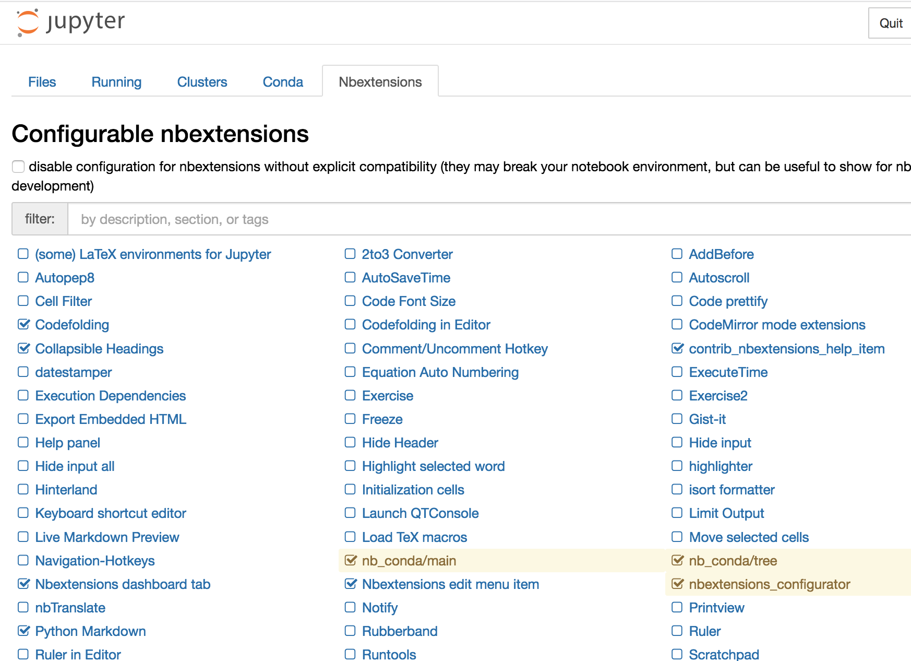

# SandvikBush

This project is for Igguanna & Judielaine to share files.

You can look at a jupyter notebook without installing anything by going to  but we will find time to do get it running on your laptop.

## For Igguanna to try

1. Open the application "Github Desktop". Confirm that the upper left says "Current repository, SandvikBush". To the right it should say "Fetch Origin": click that. 
   1. If it says "Push origin" click that, then click "fetch origin".
2. Open terminal. You can find the application in /Applications/Utilities. This will take you to the "command line".
3. When you see text prefaced with a ">" and styled like `this` it is a command to be entered on the command line and then you hit the "return" key. For example try: 
   1. `> pwd`
   2. This is the "Present Working Directory" and it will display the path of where your command line session is active.
4. `> conda deactivate`
   1. When you run this you might get a `CommandNotFoundError` which is OK
5. `> conda update conda`
   1. I ended up with a ling list of things that needed to be downloaded, removed, installed, and upgraded. Enter "y" to make the changes take place.
6. `> conda update --update-all`
   1. I had one more file that needed changes 
7. Now open Anaconda Navigator app, go to "Environments", select "SandvikBush" (you should see the ▶︎ next to it), and then  click "Remove" (trash can icon) at the bottom of the environment list pane.
8. Once it's removed, click "Import" at the bottom of the environment list pane.
9. In the popup  click on the black folder. A navigation finder window will open.
10. Navigate to the Github repository we share -- Something like Documents/GitHub/SandvikBush?
11. Once there, click on environment.yml & then "Open".
12. The finder window will go away. Click on the green "Import" button. It will churn for a while. If it prompts you to allow installing more packages, confirm the additions.
13. Now click on the ▶︎ next to environment "SandvikBush". You should see a menu of options - select "Open in Jupyter Notebook"
14. Your browser should now have a notebook open as a webpage in it. Click the horizontal menu option labeled "Nbextensions". You should see something like 
15. Check the boxes to make your configuration match the ones in the screen grab.
16. Now click the horizontal menu option labeled "Files". Use this to navigate to the Github repository we share, something like Documents/GitHub/SandvikBush?
17. Click on "Our first joint notebook.ipynb"
18. If you made it here -- WOOOOHOOOOOOO!!!!

## 2021-01-23 Effort

- starting at the ground level:
  - verified i was not in a conda environment by running `conda deactivate` at the command line.
  - `conda update conda`
    - >> `Solving environment:` 
      `Warning: 2 possible package resolutions (only showing differing packages): conda-forge/osx-64::ipykernel-5.4.3-py38h9bb44b7_0, conda-forge/osx-64::pyzmq-20.0.0-py38h1cb0b96_1  conda-forge/osx-64::ipykernel-5.4.2-py38h9bb44b7_0, conda-forge/osx-64::pyzmq-21.0.1-py38h1cb0b96done`
  - there's a LONG list of packages to download, a list of NEW packages to be INSTALLED,  a long list of upgrades, and a list of downgrades.
  - 11:28 entering y. Distracted and was done when i checked at 11:36
  - again `conda update conda`
    - "# All requested packages already installed."
  - opening anaconda & checking output of `conda info` against pre upgrade. Not significantly different.
- launching notebook from base environment. Used upper right button to "REFRESH". Then clicked little gear in right corner of Jupyter Notebook button to "upgrade". It's churning away. 11:43
  - found log `tail .anaconda/navigator/logs/navigator.log `
    - `{"time": "2021-01-23 11:44:27,506", "level": "WARNING", "module": "logs", "method": "load_log", "line": 176, "path": "/opt/anaconda3/lib/python3.8/site-packages/anaconda_navigator/utils/logs.py", "message": "Line 6. Exception - Expecting ',' delimiter: line 1 column 259 (char 258)"}`
  - restarting anaconda navigator It really seems like jupyter notebook could/should be upgraded. In light blue `↗︎6.2.0` is displayed. Other tools that appear to be at latest version show the version in a dark number and the only option for the gear icon is to install a specific version. Launching shows a progress bar with "Launching **Notebook**" briefly, no log messages, no result.

I give up on updates. We're going to go forward with the work around. 

Adding `jupyter_contrib_nbextensions` to the shared environment.  `conda env export --from-history -f environment.yml`

### Notes for later

Command line updates:

1. conda update --prefix /opt/anaconda3 anaconda
   - now 31 packages updatable
2. conda update --update-all
3. conda update conda