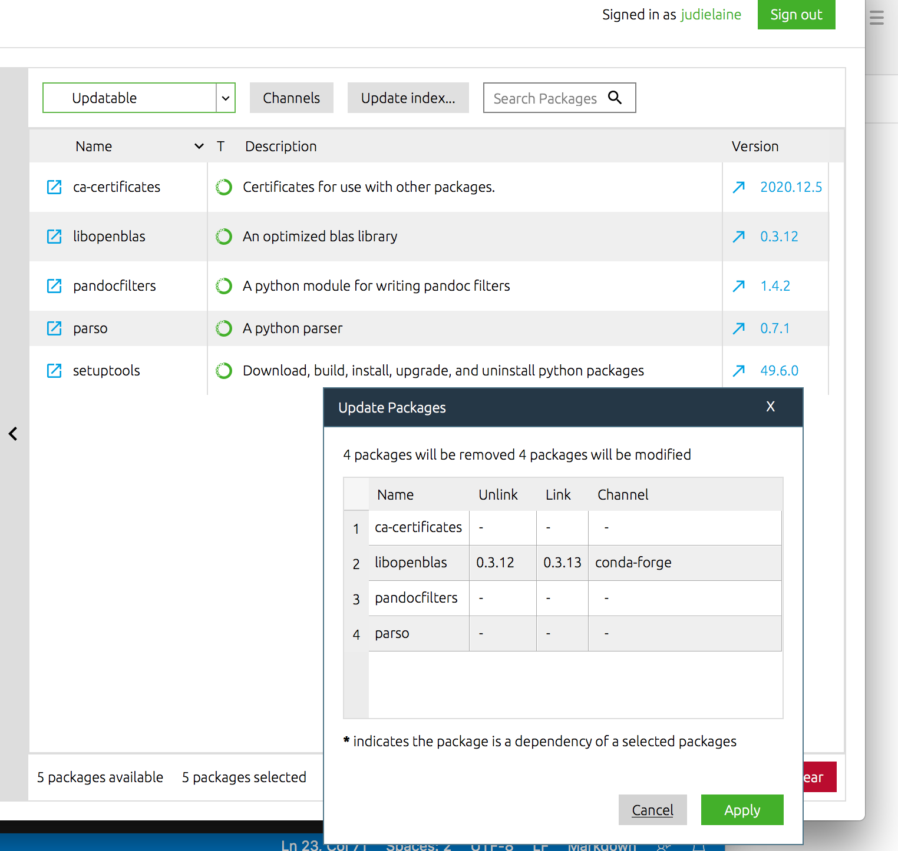

# SandvikBush

[](https://mybinder.org/v2/gh/judielaine/SandvikBush/HEAD?filepath=Our%20first%20joint%20notebook.ipynb)

This project is for W & Judielaine to share files.

You can look at a jupyter notebook without installing anything by going to [](https://mybinder.org/v2/gh/judielaine/SandvikBush/HEAD?filepath=Our%20first%20joint%20notebook.ipynb) but we will find time to do get it running on your laptop.

## For Willem to try -- soon but not yet

1. Open Anaconda Navigator, go to "Environments", select "SandvikBush", and then  click "Remove" at the bottom of the environment list pane.
2. Once it's removed, click "Import" at the bottome of the environment list pane.
3. Name the environment (SandvikBush, again), then click on the black folder. A navigation finder window will open.
4. Navigate to the Github repository we share -- Something like Documents/GitHub/SandvikBush?
5. Once there, click on environment.yml & then "Open". 
6. The finder window will go away. Click on the green "Import" button.

### Not working yet

Now we are certain to have the same environments. It's still not working so we will try updating all the libraries in the senvironment. 

1. In the pane to the right of the environment list where all the packages are listed, there's the dropdown at the top which allows selecting "Installed" and "All"  as well as "Updatable."  Select "Updatable."
2. I have five packages to update. Click on the green checkbox and a menu will pop up -- select "Mark for update" for all five packages.
3. Click the green "Apply" in the bottom right. 
4. The dependency calculation pops up -- click "Apply" when it's done.

And then it seems nothing actually updates. Very odd.



Log message:

```json
[
    {
        "level": "WARNING",
        "line": 176,
        "message": "Line 6. Exception - Expecting ',' delimiter: line 1 column 259 (char 258)",
        "method": "load_log",
        "module": "logs",
        "path": "/opt/anaconda3/lib/python3.8/site-packages/anaconda_navigator/utils/logs.py",
        "time": "2020-12-27 21:28:48,285"
    }
]
```
Starting with [these instructions (https://docs.anaconda.com/anaconda/user-guide/tasks/use-jupyter-notebook-extensions/) i opened an environment terminal by using the green triangle next to the SandvikBush environement name, and entered `conda install nb_conda`


```
Preparing transaction: done
Verifying transaction: done
Executing transaction: - Enabling nb_conda_kernels...
CONDA_PREFIX: /opt/anaconda3/envs/SandvikBush
Status: enabled

/ Config option `kernel_spec_manager_class` not recognized by `EnableNBExtensionApp`.
Enabling notebook extension nb_conda/main...
      - Validating: OK
Enabling tree extension nb_conda/tree...
      - Validating: OK
Config option `kernel_spec_manager_class` not recognized by `EnableServerExtensionApp`.
Enabling: nb_conda
- Writing config: /opt/anaconda3/envs/SandvikBush/etc/jupyter
    - Validating...
      nb_conda 2.2.1 OK

done
```

## Judith will help

- Anaconda
  - [ ] ensure appropriate packages came with Anaconda for Jupyter notebooks: 
    - [ ] Create new environment with nbconda, numpy, nb_conda, matplot..., pandas, pintpandas
  - [ ] [notebook extensions](https://docs.anaconda.com/anaconda/user-guide/tasks/use-jupyter-notebook-extensions/)
    - [ ] Codefolding, collapsable headings, nbextensions dashboard tab, nbextensions edit menu option, python markdown


## Things That Have Gone Wrong

- Notebook Refuses To Start

  - First hit seems to be in the right ballpark ["this is an issue with the nb_conda package"](https://github.com/Anaconda-Platform/nb_conda_kernels/issues/78) -- maybe i had us add the wrong module. What i really want is just the nbextension library, which this adds, but with more stuff. 
  - I have reinstalled Anaconda and now have the issue where 